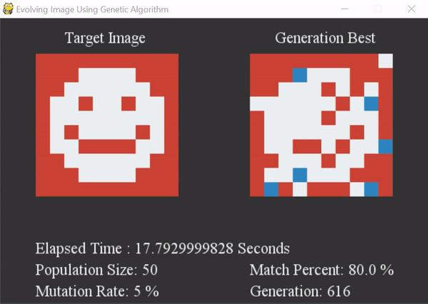

## Evolving Images or Pattern Using Genetic Algorithm

The genetic algorithm is used to evolve any randomized or smiling (Predefined in programme "Hardcoded"). 

Change the parameters such as mutation rate, population size, and so on to see how the evolution changes. 

Uncomment lines 217 and 218 to evolve a random pattern, and comment 217 and uncomment line 218 to evolve a Smiley image! 

The Evolution of Smiley demo is available below:

  

